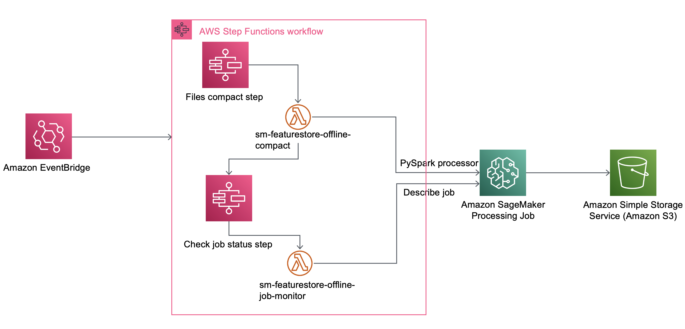
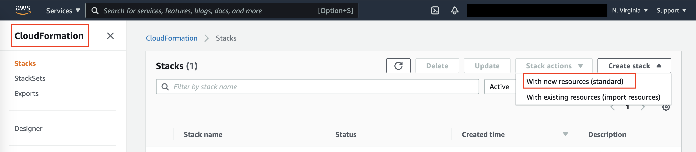
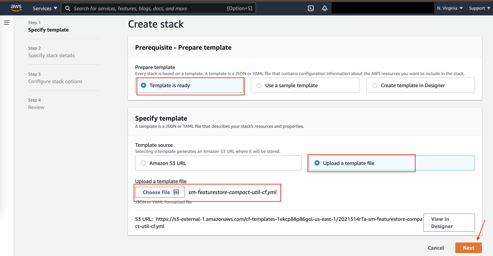
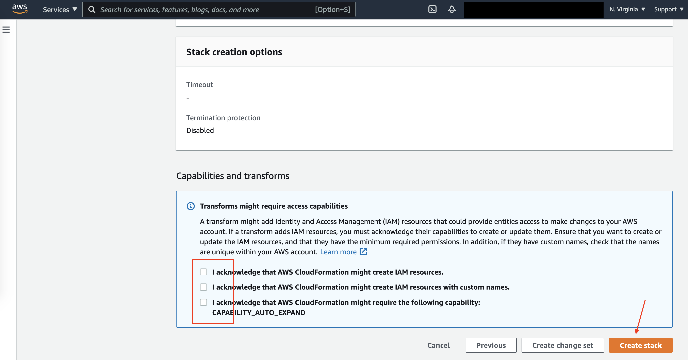
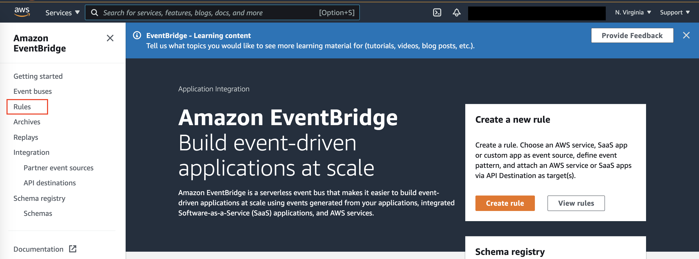
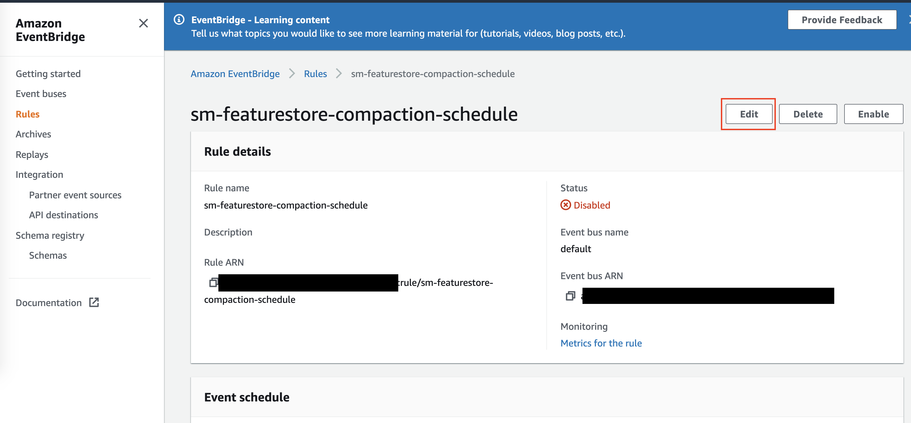
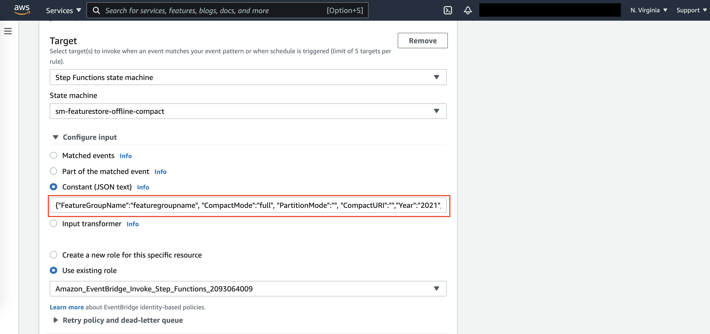
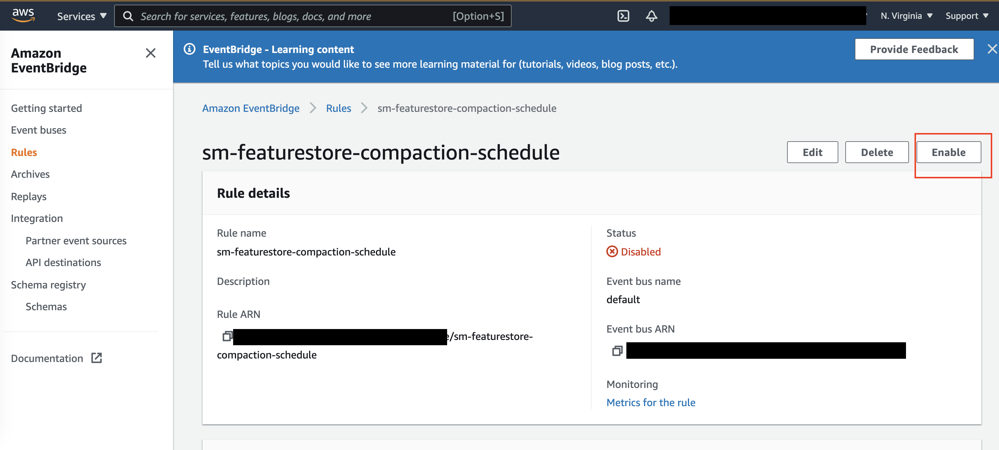
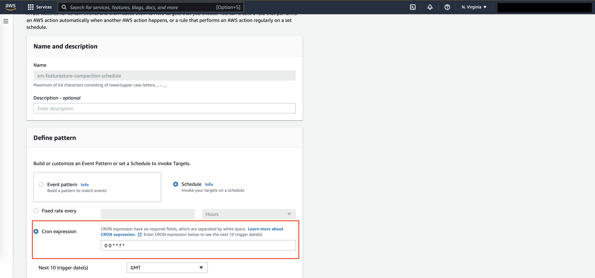
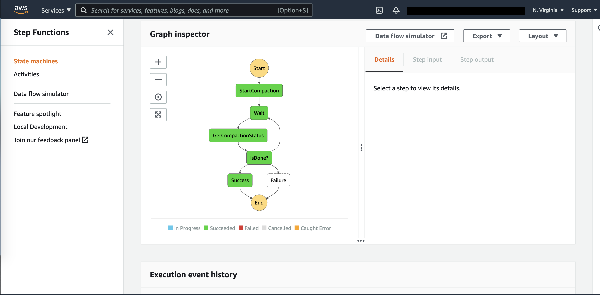

# fs-compaction-util
#### Introduction
The compaction utility is a python script that takes in a feature group name and compacts the offline store for that feature group. This script is run as a SageMaker processing job, in this case a PySpark processor.

There are 3 modes that the compaction supports:
* **full** : This mode will compact all files till date for the given feature group
* **incremental** : This mode will compact all files for the previous day for the given feature group.
* **day** : This mode will compact all files for the specified date for the given feature group.

The featurestore_offline_compact_util.compact_feature_group takes in these parameters:
* **feature_group_name - Required**: Name of the feature group
* **compact_mode - Optional**: The mode in which compaction should be run, supported modes are 'incremental','full','day'. Defaults to 'incremental'
* **compact_uri - Optional**: Target S3 URI where the compacted files should be stored. Defaults to a "compact-offline-store" prefix parallel to "offline" prefix in the feature store S3 bucket.
* **year, month, day - Required if mode is 'day'**: Specific date for which compaction should be run. Format should be YYYY for year, MM for month and DD for day.
* **partition_mode - Optional**: Valid values are 'hour' and 'day', default is 'hour'. This specifies if the files need to be compacted for an hour, or compacted for the entire day into a single file.

There are two options to run this utility:
##### 1. Serverless utility
This is a serverless architecture leveraging EventBridge to fire an event on a scheduled basis, Step functions to manage and track different states, lambda functions to create and run SageMaker processing job which compacts the files.
The EventBridge is used to schedule the compaction, the first time run can be in full mode and from then can be scheduled to run in an incremental mode. The target for the EventBridge is a Step function workflow.

Step function has two main steps
  * First step takes the input parameters from the incoming event, and calls sm-featurestore-offline-compact lambda function. The responsibility of the lambda function is to create and run a SageMaker processing job, giving it the pyspark script that has logic for data compaction.

  * Second step calls sm-featurestore-offline-job-monitor lambda function that polls the Processing job to see if it has completed, and if its a success or failure.



Key things to note:
* The step transitions can be monitored via the StepFunction console.
* All timezones are in UTC on AWS,so the script takes UTC timezone for incremental processing. UTC timezone should be used when scheduling cron job via EventBridge for incremental processing.
* If utility is run for the same files, new compact files will overwrite the existing files.

The **sm-featurestore-compact-util-cf.yml** is a CloudFormation template that creates the above resources and the IAM roles for the resources.

###### Deployment guide:
The CloudFormation (CFN) template creates 2 Lambda functions, a Step function, an Event bridge rule and IAM roles necessary for each service to invoke the next service.

Follow these steps to deploy the stack:

* There are 4 artifacts provided
    * sm-featurestore-offline-compact.zip - Lambda deployment package for compacting function.
    * sm-featurestore-offline-job-monitor.zip - Lambda deployment package for processing job status check.
    * sm-featurestore_offline_compact_spark.py - PySpark script that is fed to sagemaker processing to run compaction.
    * sm-featurestore-compact-util-cf.yml - Cloudformation template that creates all necessary resources.
* Upload the two zip files sm-featurestore-offline-compact.zip and sm-featurestore-offline-job-monitor.zip and the pyspark script sm-featurestore_offline_compact_spark.py to an S3 bucket. The S3 bucket has to be created in the same AWS Region as where Cloudformation stack will be deployed.
* Upload the sm-featurestore-compact-util-cf.yml via AWS CloudFormation console to deploy the stack. Input the S3 bucket name and prefix path as parameters to Cloudformation.
    * Go to CloudFormation console and create stack with new resources
    

    * Upload the yml file provided and click Next

    

    * Enter a name for the stack, the S3 bucket name where code is uploaded to, and the prefix location if any where code is located. Leave prefix empty if the files are directly uploaded to a bucket and not within folders. Note that prefix should not have leading or trailing slash. Click Next.

    

    * Leave the default settings on the next page and Click Next.
    * On the last page, acknowledge the access permissions and click Create Stack.

    

* SageMaker Processing job is created and run by sm-featurestore-offline-compact Lambda function. The lambda function is created with these environment configuration that can be modified anytime via Lambda console.
    * PYSPARK_SCRIPT_PATH - Pyspark script location in S3
    * SAGEMAKER_INSTANCE_COUNT - Instance count for the job, default is set to 1.
    * SAGEMAKER_INSTANCE_TYPE - Instance type, by default is configured with ml.m5.4xlarge
    * SAGEMAKER_INSTANCE_VOLUME_SIZE - Size of ML storage volume in GB, default is 30.
    * SAGEMAKER_ROLE - IAM role to execute the job, default is what gets created while deploying the stack.
    * SPARK_CONTAINER_IMAGE - Container image that the SageMaker Processing job should use. The location is configured in the Cloudformation template based on the region that the stack gets created in.


###### How to use the utility:
The Cloudformation creates an event bridge rule disabled by default and with a default schedule to run every 24 hours. The target for the rule is the step function.
The util can be scheduled in two modes via EventBridge

**1. Run the util in full mode the first time**

* Navigate to EventBridge console and click Rules.


* Click sm-featurestore-compaction-schedule rule and click Edit.


* Modify the input JSON with the feature group name, compact_mode as “full”, partiton_mode as “hour” or “day” based on needs, “compact_uri” if compated files need to go into user specified location and click Update.

  Use the event JSON structure shown here. All keys are mandatory but optional values can be blank.
```
{
    "feature_group_name":"REPLACE_WITH_FEATURE_GROUP_NAME",
    "compact_mode":"full",
    "partition_mode":"hour",
    "compact_uri":"",
    "year":"",
    "month":"",
    "day":""
}
```


* Enable the event


* The event will fire in 30-60 seconds. Navigate to Step functions and check state machine sm-featurestore-offline-compact if execution has begun (Refer to monitoring section below)

**2. Run the util in incremental mode for subsequent runs.**

* Once the util runs in “full” mode, it is time to setup the util to run in incremental manner. Navigate to EventBridge and edit the schedule to set schedule to run at midnight UTC everyday. The util will run every night at 12 AM UTC and compacts previous day’s files.



* Change the Schedule from Fixed rate every to Cron expression and set an expression to fire event at 12 AM UTC.
```
0 0 * * ? *
```

* Set the input (Constant JSON text) as":
```
{
    "feature_group_name":"REPLACE_WITH_FEATURE_GROUP_NAME",
    "compact_mode":"incremental",
    "partition_mode":"",
    "compact_uri":"",
    "year":"",
    "month":"",
    "day":""
}
```

###### Monitoring:
* Lambda and SageMaker processing jobs will create logs in Cloudwatch.
* Step functions can be monitored to check if all steps executed without errors. Navigate to Step Functions via AWS Console → StateMachines → Click on sm-featurestore-offline-compact → Click on the latest execution. A graph should be displayed to show the status of the execution. Each step in the graph shows details of input, output, execution success/failure and errors if any.



###### Validation:

* Check the S3 compact URI location for the compacted files. They will be partitioned by year, month day (and hour if partition_mode is hour). If compact_uri was not specified as an input, the files will be in the same bucket as the offline store. The S3 location will be in the below format
```
  s3://<bucket-name>/<customer-prefix>/<account-id>/sagemaker/<aws-region>/*compact-offline-store*/<feature-group-name>-<feature-group-creation-time>/data/year=<event-time-year>/ month=<event-time-month>/day=<event-time-day>/hour=<event-time-hour>/
```
* Create glue crawler and tables for this S3 data and run queries to validate the data.


##### 2. Notebook utility
This is a Jupyter notebook that calls a python function that inturn creates and runs a SageMaker processing job, giving it the pyspark script that has logic for data compaction. The pyspark script sm-processing-script/sm-featurestore_offline_compact_spark.py and the files in notebook-util folder should be uploaded to SageMaker Jupyter Notebook instance.

###### How to use the utility:
Execute the cell in the notebook to invoke the util. Change the input parameters as needed.  
```
    featurestore_offline_compact_util.compact_feature_group('feature-group-name', 'full', '', '', '', '','')
```
